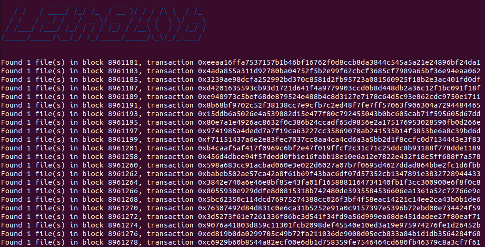

# LEthBlob

LethBlob is an OSINT tool for extracting blob files on the Ethereum network.


## Introduction

LEthBlob (Local Ether Blob) is an OSINT tool that can be used to search files on the blockchain. The program contains many functions to analyse and investigate data on the Ethereum blockchain. This tool is inspired by [EtherBlob Explorer](https://github.com/litneet64/etherblob-explorer) and has similar functionality. However EtherBlob explorer depends on the [Etherscan.io](etherscan.io) API, this tool by default makes use of a local [geth](https://geth.ethereum.org/) node. It is possible to use this tool on any Ethereum network such as Main, Rinkeby and Kovan.

## Installation
To be able to run LEthBlob you first need to install all dependencies. The LethBlob directory contains a deps.sh shell script to automatically install all dependencies. The shell script requires python3, pip and git to be installed.
To install the dependencies run the following command:

```
sudo sh deps.sh
```

## Usage
To be able to use the tool, a local geth node needs to be running with a http provider. If you have installed geth you can do this by running the command below:
```
$ sudo geth --NETWORK --http --http.api="eth,web3,personal" --syncmode full
```
After running this command the ethereum node will synchronise. This might take hours or even days depending on the network. When synchronisation is complete or when the blocks you want to inspect are downloaded you can start using the tool with the following command:
```
$ python3 LEthBlob.py COMMAND ARGS OPTIONS
```

## Examples
In this section commands and responses of LEthBlob are shown. All commands can use --host and --port to change the http provider from localhost to an external provider.

Get last block of the connected node:
```
$ python3 LEthBlob.py get-last-block
last_block: 16864671, published at: 2023-03-19 23:17:23
```
Extracting data from multiple blocks. This command can use --archive to only extract archives and --address to only extract files uploaded by a specific address. Besides using blocks as a range it is also possible to extract between a timestamp or date range, for this you need to use a different command listed in the manual.
```
$ python3 LEthsBlob.py extract-block-range 2000000 2005000
Found 1 file(s) in block 2000355, transaction 0x9c36bc2ed670d1dcc79e516224b29d1735c08738f008d5e013fa99db52d21a0e
```
Get the sender address of a transaction 
```
$ python3 LEthsBlob.py get-address-by-transaction 0x9c36bc2ed670d1dcc79e516224b29d1735c08738f008d5e013fa99db52d21a0e
0xDc2539b22b764e07613Eb8A8580f067aDb2382e1
```


## Manual
There are a lot more commands to explore, All of them are listed in this manual. To get more information about a specific command for example which arguments they require you can run --help after a command.
```
    __    ________  __    ____  __  ____    __  
   / /   / ____/ /_/ /_  / __ )/ / / /\ \  / /_ 
  / /   / __/ / __/ __ \/ __  / / / /  \ \/ __ \
 / /___/ /___/ /_/ / / / /_/ / /__\ \  / / /_/ /
/_____/_____/\__/_/ /_/_____/_____/\_\/_/_.___/ 
                                                

Usage: LEthBlob.py [OPTIONS] COMMAND [ARGS]...

Options:
  --install-completion [bash|zsh|fish|powershell|pwsh]
                                  Install completion for the specified shell.
  --show-completion [bash|zsh|fish|powershell|pwsh]
                                  Show completion for the specified shell, to
                                  copy it or customize the installation.
  --help                          Show this message and exit.

Commands:
  extract-block
  extract-block-range
  extract-date-range
  extract-timestamp-range
  extract-transaction
  get-address-by-transaction
  get-date-of-block
  get-last-block
  get-transactions-by-address
  search-block-by-date
  search-block-by-timestamp
  search-transactions
  search-transactions-date
  search-transactions-timestamp
  show-transaction
```